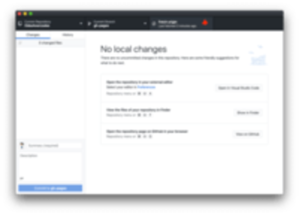
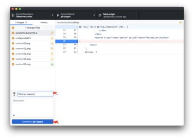
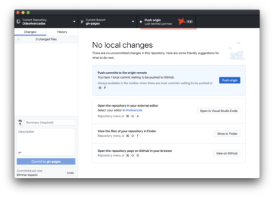
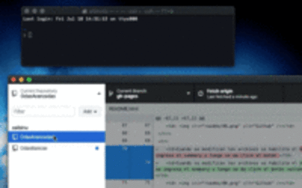
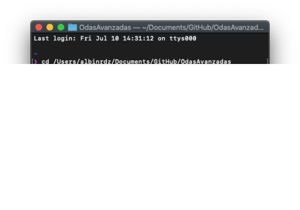

# OdasAvanzadas

- [Clonar repositorio de Github](#clonar-repositorio-de-github)
- [Servidor Local](#servidor-local)
- [Estructura HTML](#estructura-html)
- [Configuración de componentes](#configuracion-de-componentes)
    - [Scene](#scene)
    - [Info](#info)
    - [Activity](#activity)
- [Componentes de actividad](#componentes-de-actividad)
    - [Drag](#drag)
    - [Clickable](#clickable)
    - [Audiotext](#audiotext)
- [Tips](#tips)
- [EJEMPLOS](#ejemplos)
## Clonar repositorio de Github

### Configuración

Instrucción | ---
------------ | -------------
Descargar Github | 
Add > Clone Repository | 
Buscar **OdasAvanzadas**, seleccionar y click en "CLONE" | 
Abrir carpeta dando click derecho sobre el repositorio y "Reveal in Finder" | 

### Publicar cambios

Para publicar cambios se realizan "Commit", que implica colocar un título (y descripción * opcional) para saber qué se realizó.

Instrucción | ---
------------ | ---------
Al comenzar a trabajar y antes de hacer cambios "mayores" realizar un **Fetch Origin** para verificar la sincronización. Si hay datos por actualizar aparecerá el botón **Pull from Origin**, que realizará la actualización. | 
Cuando se modifican los archivos se habilita el **Commit**, donde se ingresa el summary y luego se da click al botón **Commit to gh-pages**| 
Luego de hacer el commit se hace un **Push Origin** para publicar el cambio | 


## Servidor Local

Para poder correr los htmls debe hacerse desde un servidor (local o remoto). En mac viene integrado un servidor php que se puede correr desde la terminal.

Navegar hacia el proyecto en la terminal

```shell
cd ruta/hacia/la/carpeta
```




Correr un servidor local con el comando
```console
php -S localhost:8000
```




En el navegador se va **localhost:8000/materia/pagina** y deberá cargar el interactivo.


##  Estructura HTML
```
- <html>
  - <head>
    - <title> - Cambiar título.
    - <style> - Estilos opcionales.
  - <body>
    - <app> - Agrupa todo
        - <scene> - Divide las pantallas, Se usa en inicio, en cada actividad y el final.
        - <info> - La información de la actividad, titulo, instrucciones, puntaje y tipo de actividad.
        - <activity> - Contiene toda la actividad.
```


## Configuración de componentes

### scene
  
Cada pantalla es una escena. **Siempre** debe iniciar y terminar con escenas vacias. Cada una tiene un **v-if** y un **:key** que corresponde con la posición en que se encuentra. 

La escena de incio siempre es "0" y la final es el número consecutivo según el número de actividades, además de que se usa el atributo **start-scene** o **end-scene** para la escena inicial y la final:

```html
    <scene v-if="currentScene==0" :key="0" start-scene @completed="sceneCompleted"></scene>
    <scene v-if="currentScene==1" :key="1" @completed="sceneCompleted"></scene>
    <scene v-if="currentScene==2" :key="3" end-scene :final-data="finalData"></scene>
```

Si se tienen muchas actividades(pantallas) se vería así:

```html
    <scene v-if="currentScene==0" :key="0" start-scene @completed="sceneCompleted"></scene>
    <scene v-if="currentScene==1" :key="1" @completed="sceneCompleted"></scene>
    <scene v-if="currentScene==2" :key="2" @completed="sceneCompleted"></scene>
    <scene v-if="currentScene==3" :key="3" @completed="sceneCompleted"></scene>
    <scene v-if="currentScene==4" :key="4" end-scene :final-data="finalData"></scene>
```

Atributos | SCENE
--------- | ------
| **:ansers="3"** | Es el número de respuestas que hay en el interactivo.
| **:score="50"** | El puntaje que gana por actividad (* Ignorar).
| **:temporals="temporals"** | Detecta clicks y los guarda(* Ignorar)
| **:alloks-sound** | Ruta del audio que suena al terminar con todo OK.
| **alloks** | Si se coloca, todas las respuestas deben estar **OK** para avanzar.
| **scene-color="#ffdd00"** | Colocar de partículas con las que abre la escena.
| **@completed="sceneCompleted"** | Colocar en las escenas que tienen una escena siguiente (No se coloca en la escena final).
| **hidescorebox** | Oculta la caja de Score que a parece a la derecha
| **:devmode="true"** | Habilita un panel para hacer debug de las acciones. << Primeras versiones. **
| **app.scenesCount = 1** | En el Script de abajo se deberá declarar el número de escenas en el interactivo (sin contar start ni end) (nueva versión).


#### DevMode 

El último script del html declara el DEVMode en true/false. Desde ahí se habilita para todas las escenas.

```html
<script>
    app.$devmode = false
</script>
```
### info

Atributos | INFO
--------- | ------
| **title="..."** | Título de la actividad
| **text="..."** | Instrucción
| **textaudio="..."** | Ruta del audio de la instrucción
| **type="dragdrop"** | Icono animado abajo a la derecha: "**dragdrop**", "**seleccionar**"
| **@completedinstructions="$refs.instructions2.play()"** | Se puede usar para llamar una función al término del audio de instrucción. (Ver ejemplo **/ES1T1/16/** que llama a una segunda instrucción.)
| **:autoplay="true/false"** | Las instrucciones se reproducen al cargar. Si no se coloca el atributo por default es **true**.


### activity

Sin configuración, sólo es importante que agrupe a la actividad.

## Componentes de actividad

### drag

Componente Drag & Drop.

Se coloca alrededor del objeto que se quiera arrastrar. (El objeto a arrastrar siempre debe ser una etiqueta, como img o div, no puede ser texto sólo).

```html
<drag initclass="arrastrable" dropzone=".caja" data="elemento" stay-if-ok>
    <div>Arrastrarme</div>
</drag>
```

Atributos | DRAG
--------- | ------
**initclass=""** | Clase que tendrá el objeto, en caso de tener que darle estilo. (Trae también la clase ".drag").
**dropzone=""** | Clase del objeto en que se depositará.
**data="cualquierTexto"** | El dropzone también lo tiene. Si se suelta en el dropzone y ambos tienen el mismo valor se toma como OK.
**dragsound=""** | Ruta del sonido al momento de iniciar el drag.
**dropsound=""** | Ruta del sonido al momento de soltar el objeto.
**dropzone-ok-class=""** | Clase que se añade al dropzone al soltar si es OK.
**dropzone-error-class=""** | Clase que se añade al dropzone al soltar si es ERROR.
**drag-ok-class=""** | Clase que se asigna al drag cuando se suelta y es OK. (* Requiere tener drag-error-class).
**drag-error-class=""** | Clase que se asigna al drag cuando se suelta y es ERROR. (* Requiere tener drag-ok-class).
**particle-color=""** | Color de las particulas que salen cuando es OK. De preferencia elegir el mismo color del objeto.
**append-to-dropzone | Si al soltar es OK añade el contenido del DRAG al dropzone (ejemplo: MA1T1/114)

El **drag** depende de un objeto externo que se convierte en el DROPZONE y es a donde caerá. Puede ser de cualquier tipo pero debe usar la misma clase declarada en el atributo "dropzone" del componente drag. Su relación sobre si es correcto/incorrecto depende también del atributo "data". Si en ambos es el mismo, lo tomará como OK.

```html
<drag dropzone=".caja" data="okay" stay-if-ok>
    <div>Arrastrarme</div>
</drag>
<div class="caja" data="okay" droptimes="untilok"></div>
```

El **dropzone** tiene  atributos que se ejecutan al momento de que el drag es soltado sobre él.

Atributos | DROPZONE
--------- | ------
**oksound=""** | Ruta del sonido al momento de recibir un drag y ser OK.
**errorsound=""** | Ruta del sonido al momento de recibir un drag y ser ERROR.
**data=""** | Debe corresponder con el drag que se podrá soltar. Si es igual es OK. Si no es ERROR.
**droptimes=""** | Veces que se pueden soltar drags hasta que el dropzone se deshabilite: "**multiple**" (infinito), "**once**" (una vez), "**untilok**" (cuando sea OK se deshabilita).
**:droplimit="4"** | Solo se pueden depositar "x" número de objetos. Después arroja ERROR. (Necesita **droptimes="multiple"**)


### clickable

Objetos que se les da click. Se coloca alrededor de cualquier elemento. (El objeto a arrastrar siempre debe ser una etiqueta, como img o div, no puede ser texto sólo).

```html
<clickable particle-color="#E7CED8" :isok="true" v-model="temporals[0]">
    
</clickable>
```

Atributos | CLICKABLE
--------- | ------
**:isok="true"** | "True" OK es seleccionado. "False" OK es NO seleccionado.
**`v-model="temporals[0]"`** | Se enumera según el número de opciones que habrá.
**particle-color=""** | Color de las particulas que salen cuando es OK. De preferencia elegir el mismo color del objeto.

Ejemplo de múltiples objetos click:

```html
<clickable particle-color="#E7CED8" :isok="true" v-model="temporals[0]"></clickable>
<clickable particle-color="#E7CED8" :isok="true" v-model="temporals[1]"></clickable>
<clickable particle-color="#E7CED8" :isok="true" v-model="temporals[2]"></clickable>
<clickable particle-color="#E7CED8" :isok="true" v-model="temporals[3]"></clickable>
```

### audiotext

El mismo componente que se usa para dar las instrucciones animadas con audio se puede utilizar dentro de la actividad.

```html
<audiotext :autoplay="false" text="<strong>Necesitamos:</strong> 1 plátano, 4 uvas, 1 naranja grande, 2 fresas, Miel." audio="asound/instruccion2.mp3"></audiotext>
```

Atributos | AUDIOTEXT
--------- | ------
**:autoplay="true"** | Si suena en automático al cargar o se queda en espera de click.
**text="..."** | Texto que se animará cuando ocurra el play.
**audio="..."** | Ruta del sonido.
**ref="referencia1"** | Se puede utilizar para que se mande a llamar desde algún otro componente. (Ver ejemplo **/ES1T1/16/** que llama como segunda instrucción en automático).


```html
<audiotext :autoplay="false" text="Necesitamos: 1 plátano, 4 uvas, 1 naranja grande, 2 fresas, Miel." audio="asound/instruccion2.mp3" ref="instructions2"></audiotext>
```


## Tips


### Cargar una escena en específico al inicio

**NUEVA VERSIÓN ABAJO**

Si se esta en desarrollo y se necesita cargar una escena muchas veces sin tener que estar esperando a la de comenzar se pueden cambiar los número en los **v-if="currentScene == 0"**. El primero en cargar siempre será el 0, por lo que asignando la primer escena a un numero cualquiera y añadiendo un cero a la escena que se quiera ver funcionará.

```html
<!-- se pone un numero aleatorio en vez del cero dentro del v-if -->
<scene v-if="currentScene==999" :key="0" start-scene @completed="sceneCompleted"></scene>

<!-- se coloca cero en la escena que se quiere ver al principio -->
<scene v-if="currentScene==0" :key="1">
    <info type="seleccionar" title="Sé contar elementos" text="Observa la imagen y, después selecciona las respuestas correctas." textaudio="asound/instruccion.mp3"></info>
    <activity>
        <div class="row"></div>
        <div class="row"><button class="button buttonstart" @click="sceneCompleted(false)">Siguiente</button></div>
    </activity>
</scene>
```

### Cargar una escena en específico al inicio * [NUEVA VERSIÓN]

En el script hasta abajo del html se encuentra declarado **app.currentScene**, que permite elegir la primer escena. **ES IMPORTANTE QUE...** al publicar se debe quedar en 0.

```html
<script>
    app.currentScene = 0
</script>
```

### Escena sin puntaje

Se usa "hidescorebox" en la escena y se coloca un boton que cargue la siguiente escena.

```html
<scene v-if="currentScene==1" :key="1" :answers="1" :score="50" :temporals="temporals" scene-color="#CAE1A0" @completed="sceneCompleted" hidescorebox :devmode="false">
    <info type="seleccionar" title="Sé contar elementos" text="Observa la imagen y, después selecciona las respuestas correctas." textaudio="asound/instruccion.mp3"></info>
    <activity>
        <!-- Este botón carga la siguiente escena. *sceneCompleted(false)* anula la calificación y carga la escena -->
        <div class="row"><button class="button buttonstart" @click="sceneCompleted(false)">Siguiente</button></div>
    </activity>
</scene>
```


## EJEMPLOS

### Drag básico

https://interactivos.tk/EJEMPLOS/drag-basico.html

### Clickable básico

https://interactivos.tk/EJEMPLOS/clickable-basico.html