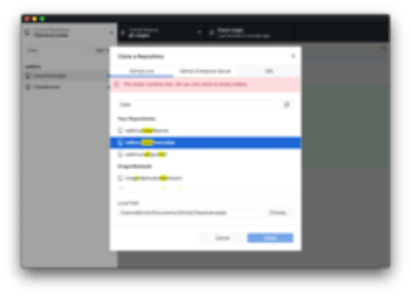
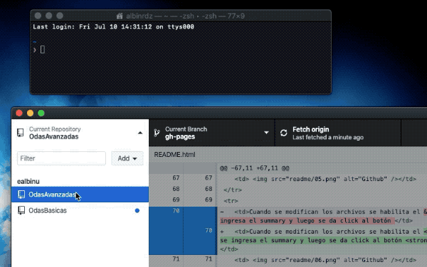

# OdasAvanzadas

- [Clonar repositorio de Github](#clonar-repositorio-de-github)
- [Servidor Local](#servidor-local)
- [Estructura HTML](#estructura-html)
- [Configuración de componentes](#configuracion-de-componentes)
    - [Scene](#scene)
    - [Info](#info)
    - [Activity](#activity)
- [Componentes de actividad](#componentes-de-actividad)
    - [Drag](#drag)
    - [Clickable](#clickable)
    - [Audiotext](#audiotext)
## Clonar repositorio de Github

### Configuración

Instrucción | ---
------------ | -------------
Descargar Github | 
Add > Clone Repository | 
Buscar **OdasAvanzadas**, seleccionar y click en "CLONE" | 
Abrir carpeta dando click derecho sobre el repositorio y "Reveal in Finder" | 

### Publicar cambios

Para publicar cambios se realizan "Commit", que implica colocar un título (y descripción * opcional) para saber qué se realizó.

Instrucción | ---
------------ | ---------
Al comenzar a trabajar y antes de hacer cambios "mayores" realizar un **Fetch Origin** para verificar la sincronización. Si hay datos por actualizar aparecerá el botón **Pull from Origin**, que realizará la actualización. | 
Cuando se modifican los archivos se habilita el **Commit**, donde se ingresa el summary y luego se da click al botón **Commit to gh-pages**| 
Luego de hacer el commit se hace un **Push Origin** para publicar el cambio | 


## Servidor Local

Para poder correr los htmls debe hacerse desde un servidor (local o remoto). En mac viene integrado un servidor php que se puede correr desde la terminal.

Navegar hacia el proyecto en la terminal

```shell
cd ruta/hacia/la/carpeta
```




Correr un servidor local con el comando
```console
php -S localhost:8000
```


En el navegador se va **localhost:8000/materia/pagina** y deberá cargar el interactivo.


##  Estructura HTML
```
- <html>
  - <head>
    - <title> - Cambiar título.
    - <style> - Estilos opcionales.
  - <body>
    - <app> - Agrupa todo
        - <scene> - Divide las pantallas, Se usa en inicio, en cada actividad y el final.
        - <info> - La información de la actividad, titulo, instrucciones, puntaje y tipo de actividad.
        - <activity> - Contiene toda la actividad.
```


## Configuración de componentes

### scene
  
Cada pantalla es una escena. **Siempre** debe iniciar y terminar con escenas vacias. Cada una tiene un **v-if** y un **:key** que corresponde con la posición en que se encuentra. 

La escena de incio siempre es "0" y la final es el número consecutivo según el número de actividades, además de que se usa el atributo **start-scene** o **end-scene** para la escena inicial y la final:

```html
    <scene v-if="currentScene==0" :key="0" start-scene @completed="sceneCompleted"></scene>
    <scene v-if="currentScene==1" :key="1" @completed="sceneCompleted"></scene>
    <scene v-if="currentScene==2" :key="3" end-scene :final-data="finalData"></scene>
```

Si se tienen muchas actividades(pantallas) se vería así:

```html
    <scene v-if="currentScene==0" :key="0" start-scene @completed="sceneCompleted"></scene>
    <scene v-if="currentScene==1" :key="1" @completed="sceneCompleted"></scene>
    <scene v-if="currentScene==2" :key="2" @completed="sceneCompleted"></scene>
    <scene v-if="currentScene==3" :key="3" @completed="sceneCompleted"></scene>
    <scene v-if="currentScene==4" :key="4" end-scene :final-data="finalData"></scene>
```

#### Atributos

Atributo | Acción
--------- | ------
| **:ansers="3"** | Es el número de respuestas que hay en el interactivo.
| **:score="50"** | El puntaje que gana por actividad (* Ignorar).
| **:temporals="temporals"** | Detecta clicks y los guarda(* Ignorar)
| **:alloks-sound** | Ruta del audio que suena al terminar con todo OK.
| **alloks** | Si se coloca, todas las respuestas deben estar **OK** para avanzar.
| **scene-color="#ffdd00"** | Colocar de partículas con las que abre la escena.
| **@completed="sceneCompleted"** | Colocar en las escenas que tienen una escena siguiente (No se coloca en la escena final).
| **:devmode="true"** | Habilita un panel para hacer debuggin de las acciones.


### info

Atributo | Acción
--------- | ------
| **title="..."** | Título de la actividad
| **text="..."** | Instrucción
| **textaudio="..."** | Ruta del audio de la instrucción
| **type="dragdrop"** | Icono animado abajo a la derecha: dragdrop | seleccionar
| **@completedinstructions="$refs.instructions2.play()"** | Se puede usar para llamar una función al término del audio de instrucción. (Ver ejemplo **/ES1T1/16/** que llama a una segunda instrucción.)

### activity

## Componentes de actividad


### drag

### clickable

### audiotext