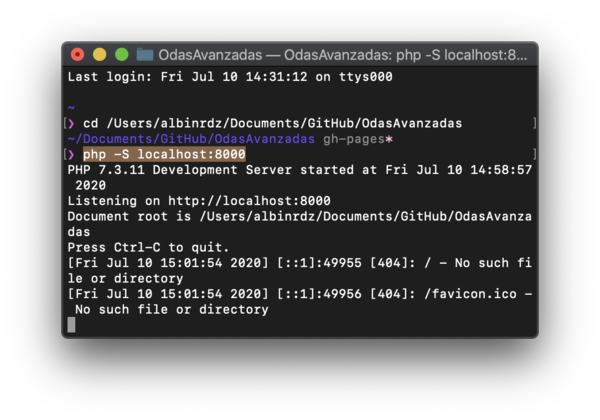

# OdasAvanzadas


## Clonar repositorio de Github

### Configuración

Instrucción | ---
------------ | -------------
Descargar Github | 
Add > Clone Repository | 
Buscar **OdasAvanzadas**, seleccionar y click en "CLONE" | 
Abrir carpeta dando click derecho sobre el repositorio y "Reveal in Finder" | 

### Publicar cambios

Para publicar cambios se realizan "Commit", que implica colocar un título (y descripción * opcional) para saber qué se realizó.

Instrucción | ---
------------ | ---------
Al comenzar a trabajar y antes de hacer cambios "mayores" realizar un **Fetch Origin** para verificar la sincronización. Si hay datos por actualizar aparecerá el botón **Pull from Origin**, que realizará la actualización. | 
Cuando se modifican los archivos se habilita el **Commit**, donde se ingresa el summary y luego se da click al botón **Commit to gh-pages**| 
Luego de hacer el commit se hace un **Push Origin** para publicar el cambio | 


## Servidor Local (mac) para correr el proyecto


Navegar hacia el proyecto en la terminal
```shell
cd ruta/hacia/la/carpeta
```


Correr un servidor local con el comando
```console
php -S localhost:8000
```




En el navegador se va **localhost:8000/materia/pagina** y deberá cargar el interactivo.


##  Estructura del HTML

- :arrow_forward: **<html>**
  - 	:arrow_forward:	:arrow_forward: **<head>**
      - 	:arrow_forward: :arrow_forward:	:arrow_forward: **<title>** - Cambiar título
      - 	:arrow_forward: :arrow_forward:	:arrow_forward: **<style>** - Estilos opcionales
  - 	:arrow_forward:	:arrow_forward: **<body>**


### Drag (& drop)
